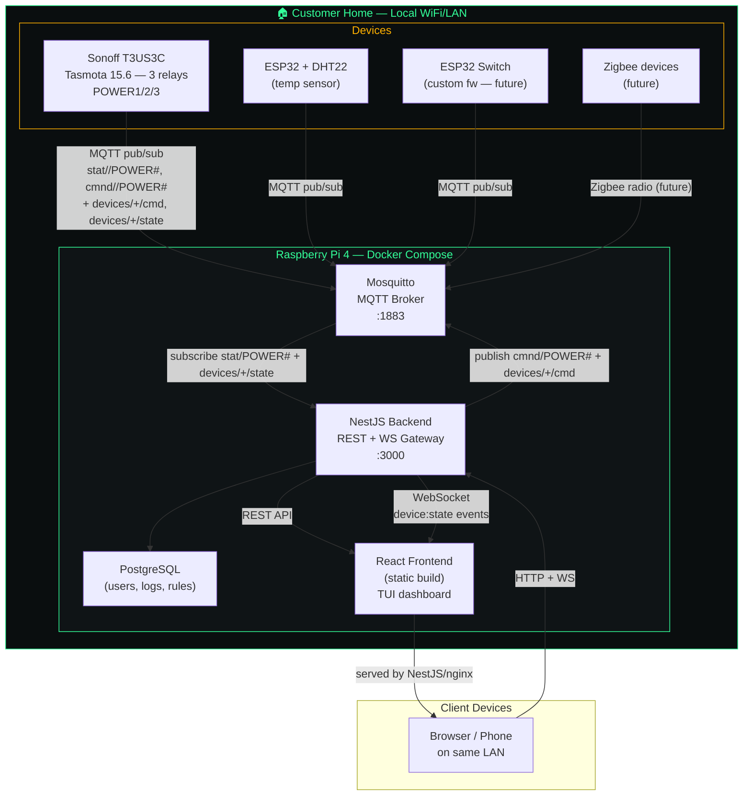

# IoT Home Control — Stack Architecture

## Overview

Local-first smart home platform. Everything runs on a single Raspberry Pi
inside the customer's home network — no cloud dependency for core
automation. Devices speak MQTT directly. The physical wall switch is a
**Sonoff T3US3C flashed Tasmota** — MQTT-native, no cloud, no Tuya — and
bridges straight into the backend over the shared Mosquitto broker.

## Diagram

## Layer breakdown

| Layer | Technology | Role |
|---|---|---|
| **Device firmware** | Sonoff T3US3C (Tasmota 15.6), ESP32 (Arduino/ESP-IDF) | Publishes state, subscribes to commands over MQTT |
| **Switch adapter** | NestJS `SonoffService` (raw MQTT) | Speaks Tasmota topics (`stat/POWER#`, `cmnd/POWER#`) so each relay becomes a normal `sonoff{1,2,3}` device |
| **Message bus** | Mosquitto (MQTT broker) | Single source of truth for device state/commands; every device and service talks through here |
| **Backend** | NestJS (MQTT + REST + WebSocket gateway) | Business logic, device registry, API for the frontend |
| **Persistence** | PostgreSQL | Users, device registry, automation rules, historical logs |
| **Frontend** | React + Vite + TS (TUI/terminal styled) | Customer-facing dashboard — room containers, toggles, sensor readouts |
| **Host** | Raspberry Pi 4, Docker Compose | Single physical box per customer home, all services containerized |

## Data flow (device → user)

1. Device publishes to `devices/<id>/state` on Mosquitto.
2. NestJS's MQTT listener (wildcard `devices/+/state`) picks it up, updates in-memory/DB state.
3. NestJS's WebSocket gateway broadcasts `device:state` to connected browsers.
4. React updates the relevant room container/toggle live, no polling.

## Data flow (user → device)

1. User taps a toggle in React → `POST /devices/:id/command`.
2. NestJS publishes JSON command to `devices/<id>/cmd`.
3. Device (or Home Assistant on its behalf) executes the action, publishes new state back to `devices/<id>/state`.
4. Loop closes via the same WebSocket broadcast path above.

## Local-first principles this stack follows

- No feature depends on internet access — only local LAN + this Pi.
- Any device brand is welcome as long as it speaks MQTT (the Sonoff Tasmota
  switch is integrated natively; the backend's unique Tasmota bridge lives only
  in `SonoffService` and never leaks into the generic device layer).
- The generic device layer only ever knows MQTT topics + JSON payloads, so any
  other MQTT-native hardware can be added without backend code changes.
- No cloud SDKs (Tuya got removed) — the stack is fully local and decoupled from
  any vendor dependency.
